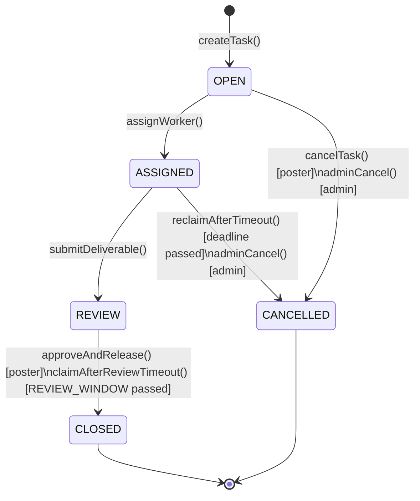

# Design Document — Gig Platform (Monad Testnet)

## Overview

Gig is a trustless decentralized gig marketplace on Monad testnet. A poster locks ETH in escrow via `TaskEscrow.sol`, workers register in `WorkerRegistry.sol` and submit bids, and payment is released automatically through a state machine with timeout protection. There is no backend, no database, and no token — the contract event log and IPFS are the sole sources of truth.

The MVP covers the complete poster-worker lifecycle:

```
Register → Create Task → Bid → Assign → Deliver → Approve/Timeout → Withdraw
```

Key design constraints:
- `MAX_TASK_VALUE = 1 ether` bounds exploit blast radius during unaudited phase
- All ETH payouts use a pull-payment ledger (no direct `.call{value}()` to arbitrary addresses)
- `ReentrancyGuard` on all payout functions
- Two-step admin transfer for operational safety
- Monad testnet: chainId 143 (0x8f), currency MON, block gas limit 200,000,000

---

## Architecture

```mermaid
graph TD
    subgraph Monad Testnet
        WR[WorkerRegistry.sol]
        TE[TaskEscrow.sol]
        TE -->|isRegistered| WR
    end

    subgraph Frontend - Next.js 14 App Router
        Feed[/ - Task Feed]
        Detail[/tasks/id - Task Detail]
        Create[/tasks/create - Create Task]
        Profile[/profile/address - Worker Profile]
        Dashboard[/dashboard]
    end

    subgraph IPFS
        NFTStorage[nft.storage HTTP API]
        CFGateway[cloudflare-ipfs.com gateway]
    end

    Frontend -->|wagmi v2 + viem| Monad Testnet
    Frontend -->|upload JSON| NFTStorage
    Frontend -->|fetch metadata| CFGateway
    Frontend -->|useWatchContractEvent| TE
```

### Component Responsibilities

| Component | Responsibility |
|---|---|
| `WorkerRegistry.sol` | Worker registration, skill bitmask storage, `isRegistered()` view |
| `TaskEscrow.sol` | Task lifecycle, escrow, bids, state machine, pull-payment ledger |
| Next.js frontend | UI, wallet interaction, IPFS upload/fetch, event indexing |
| nft.storage HTTP API | IPFS pinning for task metadata, bids, deliverables, profiles |
| Cloudflare IPFS gateway | Content retrieval for display |

### Data Flow

```
1. Poster uploads metadata JSON → nft.storage → receives CID
2. Poster calls createTask(cid, deadline) with msg.value → TaskEscrow emits TaskCreated
3. Frontend watches TaskCreated events → builds in-memory task index
4. Worker calls submitBid(taskId, proposalCid, proposedPrice) → TaskEscrow stores Bid struct
5. Poster calls assignWorker(taskId, worker) → state OPEN → ASSIGNED
6. Worker uploads deliverable → calls submitDeliverable(taskId, cid) → state ASSIGNED → REVIEW
7. Poster calls approveAndRelease(taskId) → credits pendingWithdrawals[worker]
8. Worker calls withdraw() → receives ETH
```

---

## Components and Interfaces

### WorkerRegistry.sol

```solidity
// SPDX-License-Identifier: MIT
pragma solidity ^0.8.24;

interface IWorkerRegistry {
    function isRegistered(address worker) external view returns (bool);
}

contract WorkerRegistry is IWorkerRegistry {
    struct Worker {
        bytes32 nameHash;      // keccak256 of display name
        uint64  skillBitmask;  // bit 0-7 defined, bits 8-63 reserved
        bool    registered;
    }

    mapping(address => Worker) public workers;

    event WorkerRegistered(address indexed worker, bytes32 nameHash, uint64 skillBitmask);

    function registerWorker(bytes32 nameHash, uint64 skillBitmask) external;
    function updateSkills(uint64 skillBitmask) external;
    function isRegistered(address worker) external view returns (bool);
}
```

Skill bitmask (MVP-defined bits):

| Bit | Skill |
|---|---|
| 0 | Smart contract development |
| 1 | Frontend development |
| 2 | Backend development |
| 3 | UI/UX design |
| 4 | Security audit |
| 5 | Technical writing |
| 6 | Data labeling |
| 7 | QA / testing |
| 8–63 | Reserved |

### TaskEscrow.sol

```solidity
// SPDX-License-Identifier: MIT
pragma solidity ^0.8.24;

import "@openzeppelin/contracts/utils/ReentrancyGuard.sol";

contract TaskEscrow is ReentrancyGuard {
    // --- State machine ---
    enum TaskState { OPEN, ASSIGNED, REVIEW, CLOSED, CANCELLED }

    // --- Structs ---
    struct Task {
        address   poster;
        address   worker;           // zero until assigned
        string    metadataCid;
        string    deliverableCid;   // set on submitDeliverable
        uint256   budget;
        uint64    deadline;
        uint64    reviewDeadline;   // set when entering REVIEW
        TaskState state;
    }

    struct Bid {
        string  proposalCid;
        uint256 proposedPrice;
        bool    exists;
    }

    // --- Storage ---
    mapping(uint256 => Task)                          public tasks;
    mapping(uint256 => mapping(address => Bid))       public bids;
    mapping(address => uint256)                       public pendingWithdrawals;
    uint256 public nextTaskId;

    // --- Constants ---
    uint256 public constant MAX_TASK_VALUE = 1 ether;
    uint64  public constant REVIEW_WINDOW  = 7 days;

    // --- Admin ---
    address public admin;
    address public pendingAdmin;
    IWorkerRegistry public immutable registry;

    // --- Events ---
    event TaskCreated(uint256 indexed taskId, address indexed poster, string cid, uint256 budget, uint64 deadline);
    event BidSubmitted(uint256 indexed taskId, address indexed worker, string proposalCid, uint256 proposedPrice);
    event WorkerAssigned(uint256 indexed taskId, address indexed worker);
    event DeliverableSubmitted(uint256 indexed taskId, string deliverableCid);
    event PaymentReleased(uint256 indexed taskId, address indexed worker, uint256 amount);
    event TaskCancelled(uint256 indexed taskId, address indexed refundedTo);
    event AdminOverride(uint256 indexed taskId, string reason);
    event NewAdminProposed(address indexed newAdmin);

    // --- Constructor ---
    constructor(address _registry, address _admin);

    // --- Poster actions ---
    function createTask(string calldata metadataCid, uint64 deadline) external payable returns (uint256 taskId);
    function assignWorker(uint256 taskId, address worker) external;
    function approveAndRelease(uint256 taskId) external;
    function cancelTask(uint256 taskId) external;
    function reclaimAfterTimeout(uint256 taskId) external nonReentrant;

    // --- Worker actions ---
    function submitBid(uint256 taskId, string calldata proposalCid, uint256 proposedPrice) external;
    function submitDeliverable(uint256 taskId, string calldata deliverableCid) external;
    function claimAfterReviewTimeout(uint256 taskId) external nonReentrant;

    // --- Shared ---
    function withdraw() external nonReentrant;

    // --- Admin ---
    function adminCancel(uint256 taskId, string calldata reason) external;
    function proposeAdmin(address newAdmin) external;
    function acceptAdmin() external;
}
```

### State Machine



### Frontend Pages and Hooks

| Page | Route | Auth Required | Key Hooks |
|---|---|---|---|
| Task Feed | `/` | No | `useWatchContractEvent(TaskCreated)` |
| Task Detail | `/tasks/[id]` | No | `useReadContract(tasks)`, `useWatchContractEvent(BidSubmitted)` |
| Create Task | `/tasks/create` | Yes | `useWriteContract(createTask)` |
| Worker Profile | `/profile/[address]` | No | `useReadContract(workers)` |
| Dashboard | `/dashboard` | Yes | `useReadContract`, `useWatchContractEvent` |

```typescript
// lib/contracts.ts
export const TASK_ESCROW = {
  address: process.env.NEXT_PUBLIC_TASK_ESCROW_ADDRESS as `0x${string}`,
  abi: TaskEscrowABI,
} as const

export const WORKER_REGISTRY = {
  address: process.env.NEXT_PUBLIC_WORKER_REGISTRY_ADDRESS as `0x${string}`,
  abi: WorkerRegistryABI,
} as const

// Monad testnet chain config
export const monadTestnet = {
  id: 143,
  name: 'Monad Testnet',
  nativeCurrency: { name: 'MON', symbol: 'MON', decimals: 18 },
  rpcUrls: { default: { http: [process.env.NEXT_PUBLIC_MONAD_RPC_URL!] } },
  blockExplorers: {
    default: { name: 'MonadVision', url: 'https://monadvision.com' },
    monadScan: { name: 'MonadScan', url: 'https://monadscan.com' },
  },
} as const
```

### IPFS Upload (nft.storage HTTP API)

```typescript
async function pinToIPFS(metadata: object): Promise<string> {
  const blob = new Blob([JSON.stringify(metadata)], { type: 'application/json' })
  const formData = new FormData()
  formData.append('file', blob)

  const res = await fetch('https://api.nft.storage/upload', {
    method: 'POST',
    headers: { Authorization: `Bearer ${process.env.NFT_STORAGE_API_KEY}` },
    body: formData,
  })
  const { value } = await res.json()
  return value.cid
}
```

---

## Data Models

### On-Chain Structs

```solidity
struct Task {
    address   poster;
    address   worker;
    string    metadataCid;
    string    deliverableCid;
    uint256   budget;
    uint64    deadline;
    uint64    reviewDeadline;
    TaskState state;           // uint8 enum
}

struct Bid {
    string  proposalCid;
    uint256 proposedPrice;
    bool    exists;
}

struct Worker {                // WorkerRegistry
    bytes32 nameHash;
    uint64  skillBitmask;
    bool    registered;
}
```

### IPFS Metadata Schemas

**Task metadata** (uploaded by poster before `createTask`):
```json
{
  "version": "1.0",
  "title": "string",
  "description": "string (markdown)",
  "skills": [0, 1],
  "attachments": ["ipfs://CID"],
  "posterProfile": "ipfs://CID"
}
```

**Bid proposal** (uploaded by worker before `submitBid`):
```json
{
  "version": "1.0",
  "proposal": "string (markdown)",
  "deliveryDays": 3,
  "workerProfile": "ipfs://CID"
}
```

**Deliverable** (uploaded by worker before `submitDeliverable`):
```json
{
  "version": "1.0",
  "summary": "string",
  "files": ["ipfs://CID"],
  "notes": "string"
}
```

**Worker profile** (uploaded before `registerWorker`):
```json
{
  "version": "1.0",
  "displayName": "string",
  "bio": "string",
  "github": "string",
  "twitter": "string",
  "portfolio": ["ipfs://CID"]
}
```

### Environment Variables

```bash
# .env.example

# Contracts (deploy)
PRIVATE_KEY=0x...
MONAD_RPC_URL=https://testnet-rpc.monad.xyz
ADMIN_ADDRESS=0x...

# Frontend (public)
NEXT_PUBLIC_TASK_ESCROW_ADDRESS=0x...
NEXT_PUBLIC_WORKER_REGISTRY_ADDRESS=0x...
NEXT_PUBLIC_MONAD_RPC_URL=https://testnet-rpc.monad.xyz
NEXT_PUBLIC_CHAIN_ID=143

# IPFS
NFT_STORAGE_API_KEY=...
```

### Foundry Project Structure

```
contracts/
  src/
    TaskEscrow.sol
    WorkerRegistry.sol
    interfaces/
      ITaskEscrow.sol
      IWorkerRegistry.sol
  test/
    TaskEscrow.t.sol
    TaskEscrowTimeout.t.sol
    WorkerRegistry.t.sol
  script/
    Deploy.s.sol
  foundry.toml
frontend/
  src/
    app/
      page.tsx                  ← /
      tasks/[id]/page.tsx
      tasks/create/page.tsx
      profile/[address]/page.tsx
      dashboard/page.tsx
    lib/
      contracts.ts
      ipfs.ts
    abi/
      TaskEscrow.json
      WorkerRegistry.json
  package.json
```


---

## Correctness Properties

*A property is a characteristic or behavior that should hold true across all valid executions of a system — essentially, a formal statement about what the system should do. Properties serve as the bridge between human-readable specifications and machine-verifiable correctness guarantees.*

### Property 1: Worker Registration Round-Trip

*For any* wallet address, nameHash, and skillBitmask, after calling `registerWorker(nameHash, skillBitmask)`, reading `workers[addr]` should return a struct with `registered == true`, `nameHash` matching the input, `skillBitmask` matching the input, and `isRegistered(addr)` should return `true`.

**Validates: Requirements 1.1, 1.2, 1.6**

---

### Property 2: Double Registration Reverts

*For any* already-registered address, calling `registerWorker` a second time should always revert.

**Validates: Requirements 1.3**

---

### Property 3: updateSkills Round-Trip

*For any* registered address and any uint64 skillBitmask, calling `updateSkills(skillBitmask)` should result in `workers[addr].skillBitmask` equaling the new value.

**Validates: Requirements 1.4**

---

### Property 4: updateSkills Without Registration Reverts

*For any* unregistered address, calling `updateSkills` should always revert.

**Validates: Requirements 1.5**

---

### Property 5: createTask Round-Trip

*For any* valid metadataCid, deadline (> block.timestamp), and msg.value in (0, MAX_TASK_VALUE], calling `createTask` should store a Task with `poster == msg.sender`, `budget == msg.value`, `deadline == input deadline`, `metadataCid == input cid`, `state == OPEN`, and return a taskId equal to the previous `nextTaskId`.

**Validates: Requirements 2.1, 2.5, 2.6**

---

### Property 6: Task Value Cap Enforced

*For any* msg.value > MAX_TASK_VALUE (1 ether), calling `createTask` should revert. Additionally, msg.value == 0 should revert. The boundary value MAX_TASK_VALUE itself should succeed.

**Validates: Requirements 2.2, 2.3, 13.1, 13.2**

---

### Property 7: Deadline Validation

*For any* deadline ≤ block.timestamp, calling `createTask` should revert.

**Validates: Requirements 2.4**

---

### Property 8: Task Feed Filter Correctness

*For any* list of tasks and any combination of filter parameters (skill bitmask, minimum budget, deadline range), the filtered result should contain only tasks that satisfy all active filter criteria, and no task satisfying all criteria should be excluded.

**Validates: Requirements 3.3**

---

### Property 9: Task Card Rendering Contains Required Fields

*For any* task object with valid fields, the rendered task card string/component should contain the budget, deadline, and a truncated form of the poster address.

**Validates: Requirements 3.2**

---

### Property 10: submitBid Registration Gate

*For any* unregistered address calling `submitBid` on any OPEN task, the call should always revert.

**Validates: Requirements 4.1**

---

### Property 11: Bid Round-Trip

*For any* registered worker, OPEN task, valid proposalCid, and proposedPrice ≤ task.budget, after calling `submitBid`, reading `bids[taskId][worker]` should return a Bid with `exists == true`, `proposalCid` matching the input, and `proposedPrice` matching the input. A second call to `submitBid` for the same task by the same worker should revert.

**Validates: Requirements 4.4, 4.5**

---

### Property 12: Bid Price Cap

*For any* proposedPrice > task.budget, calling `submitBid` should revert.

**Validates: Requirements 4.3**

---

### Property 13: State Machine — Invalid Transitions Revert

*For any* task in state S, calling a transition function that requires a different state S' (where S ≠ S') should always revert. Specifically: `submitBid` on non-OPEN tasks, `assignWorker` on non-OPEN tasks, `cancelTask` on non-OPEN tasks, `submitDeliverable` on non-ASSIGNED tasks, `approveAndRelease` on non-REVIEW tasks, `reclaimAfterTimeout` on non-ASSIGNED tasks, `claimAfterReviewTimeout` on non-REVIEW tasks.

**Validates: Requirements 4.2, 5.3, 6.3, 7.3, 8.3, 9.3, 10.3**

---

### Property 14: Authorization — Only Authorized Callers Succeed

*For any* task and any address that is not the task's poster, calling `assignWorker`, `cancelTask`, `approveAndRelease`, or `reclaimAfterTimeout` should revert. *For any* task and any address that is not the task's assigned worker, calling `submitDeliverable` or `claimAfterReviewTimeout` should revert.

**Validates: Requirements 5.2, 6.2, 7.2, 8.2, 9.1, 10.1**

---

### Property 15: assignWorker Requires Existing Bid

*For any* task in OPEN state and any worker address where `bids[taskId][worker].exists == false`, calling `assignWorker(taskId, worker)` should revert.

**Validates: Requirements 5.4**

---

### Property 16: cancelTask Refunds Poster via Pull-Payment

*For any* OPEN task, after the poster calls `cancelTask`, the task state should be CANCELLED and `pendingWithdrawals[poster]` should increase by exactly `task.budget`.

**Validates: Requirements 6.1, 6.4**

---

### Property 17: submitDeliverable Sets reviewDeadline Correctly

*For any* ASSIGNED task, after the assigned worker calls `submitDeliverable(taskId, cid)`, the task state should be REVIEW, `task.deliverableCid` should equal the input cid, and `task.reviewDeadline` should equal `block.timestamp + REVIEW_WINDOW` (604800 seconds).

**Validates: Requirements 7.1, 10.5**

---

### Property 18: approveAndRelease Credits Worker

*For any* task in REVIEW state, after the poster calls `approveAndRelease`, the task state should be CLOSED and `pendingWithdrawals[task.worker]` should increase by exactly `task.budget`.

**Validates: Requirements 8.1**

---

### Property 19: withdraw Round-Trip with Checks-Effects-Interactions

*For any* address with `pendingWithdrawals[addr] > 0`, after calling `withdraw()`, the address's ETH balance should increase by the prior pending amount and `pendingWithdrawals[addr]` should be zero. The balance is zeroed before the transfer (CEI pattern).

**Validates: Requirements 8.4, 12.4**

---

### Property 20: reclaimAfterTimeout — Deadline Enforcement

*For any* ASSIGNED task where `block.timestamp ≤ task.deadline`, calling `reclaimAfterTimeout` should revert. *For any* ASSIGNED task where `block.timestamp > task.deadline`, calling `reclaimAfterTimeout` should succeed, set state to CANCELLED, and credit `task.budget` to `pendingWithdrawals[poster]`.

**Validates: Requirements 9.1, 9.2**

---

### Property 21: claimAfterReviewTimeout — Review Window Enforcement

*For any* REVIEW task where `block.timestamp ≤ task.reviewDeadline`, calling `claimAfterReviewTimeout` should revert. *For any* REVIEW task where `block.timestamp > task.reviewDeadline`, calling `claimAfterReviewTimeout` should succeed, set state to CLOSED, and credit `task.budget` to `pendingWithdrawals[worker]`.

**Validates: Requirements 10.1, 10.2**

---

### Property 22: Reentrancy Blocked on All Payout Functions

*For any* malicious contract that attempts to re-enter `withdraw()`, `reclaimAfterTimeout()`, or `claimAfterReviewTimeout()` during execution, the reentrant call should revert and the attacker should receive funds at most once.

**Validates: Requirements 9.4, 10.4, 12.3**

---

### Property 23: Balance Integrity Invariant

*For any* sequence of valid contract operations, the sum of all `pendingWithdrawals` balances plus the contract's ETH balance should equal the total ETH deposited via `createTask` minus the total ETH withdrawn via `withdraw()`.

**Validates: Requirements 12.2**

---

### Property 24: Admin Two-Step Transfer Round-Trip

*For any* current admin and proposed new admin address, after the current admin calls `proposeAdmin(newAdmin)` and then `newAdmin` calls `acceptAdmin()`, `admin` should equal `newAdmin`. Any address other than `newAdmin` calling `acceptAdmin()` before the transfer completes should revert.

**Validates: Requirements 11.3, 11.4**

---

### Property 25: adminCancel Credits Poster

*For any* task in any non-terminal state, after the admin calls `adminCancel(taskId, reason)`, the task state should be CANCELLED and `pendingWithdrawals[task.poster]` should increase by `task.budget`.

**Validates: Requirements 11.1**

---

### Property 26: Non-Admin adminCancel Reverts

*For any* address that is not the current admin, calling `adminCancel` should always revert.

**Validates: Requirements 11.2**

---

## Error Handling

### Contract Error Conditions

| Function | Condition | Error |
|---|---|---|
| `registerWorker` | Already registered | `AlreadyRegistered()` |
| `updateSkills` | Not registered | `NotRegistered()` |
| `createTask` | `msg.value == 0` | `ZeroBudget()` |
| `createTask` | `msg.value > MAX_TASK_VALUE` | `ExceedsMaxValue()` |
| `createTask` | `deadline <= block.timestamp` | `InvalidDeadline()` |
| `submitBid` | Caller not registered | `NotRegistered()` |
| `submitBid` | Task not OPEN | `InvalidState()` |
| `submitBid` | `proposedPrice > task.budget` | `PriceTooHigh()` |
| `submitBid` | Bid already exists | `BidAlreadyExists()` |
| `assignWorker` | Not poster | `Unauthorized()` |
| `assignWorker` | Task not OPEN | `InvalidState()` |
| `assignWorker` | Bid does not exist | `BidNotFound()` |
| `cancelTask` | Not poster | `Unauthorized()` |
| `cancelTask` | Task not OPEN | `InvalidState()` |
| `submitDeliverable` | Not assigned worker | `Unauthorized()` |
| `submitDeliverable` | Task not ASSIGNED | `InvalidState()` |
| `approveAndRelease` | Not poster | `Unauthorized()` |
| `approveAndRelease` | Task not REVIEW | `InvalidState()` |
| `reclaimAfterTimeout` | Not poster | `Unauthorized()` |
| `reclaimAfterTimeout` | Task not ASSIGNED | `InvalidState()` |
| `reclaimAfterTimeout` | Deadline not passed | `DeadlineNotPassed()` |
| `claimAfterReviewTimeout` | Not worker | `Unauthorized()` |
| `claimAfterReviewTimeout` | Task not REVIEW | `InvalidState()` |
| `claimAfterReviewTimeout` | Review window not passed | `ReviewWindowNotPassed()` |
| `withdraw` | Zero balance | `NothingToWithdraw()` |
| `adminCancel` | Not admin | `Unauthorized()` |
| `acceptAdmin` | Not pending admin | `Unauthorized()` |

All errors use custom error types (Solidity `^0.8.24`) for gas efficiency.

### Frontend Error Handling

- Wallet not connected: redirect to connect prompt on protected pages (`/tasks/create`, `/dashboard`)
- Wrong network: display network switch prompt via `wallet_addEthereumChain`
- IPFS upload failure: show retry UI, do not proceed to contract call
- Contract revert: parse revert reason from viem error and display human-readable message
- Transaction pending: disable submit button, show spinner with tx hash link to MonadVision
- IPFS fetch failure: show "metadata unavailable" placeholder, do not crash the feed

---

## Testing Strategy

### Dual Testing Approach

Both unit tests and property-based tests are required. They are complementary:
- Unit tests catch concrete bugs at specific inputs and integration points
- Property tests verify universal correctness across the full input space

### Contract Testing (Foundry)

**Property-Based Fuzz Tests** — minimum 100 runs each, configured via `foundry.toml`:

```toml
[fuzz]
runs = 256
```

Each fuzz test is tagged with a comment referencing the design property:
```
// Feature: gig-platform, Property N: <property_text>
```

| Test | Property | File |
|---|---|---|
| `testFuzz_workerRegistrationRoundTrip` | Property 1 | `WorkerRegistry.t.sol` |
| `testFuzz_doubleRegistrationReverts` | Property 2 | `WorkerRegistry.t.sol` |
| `testFuzz_updateSkillsRoundTrip` | Property 3 | `WorkerRegistry.t.sol` |
| `testFuzz_updateSkillsUnregisteredReverts` | Property 4 | `WorkerRegistry.t.sol` |
| `testFuzz_createTaskRoundTrip` | Property 5 | `TaskEscrow.t.sol` |
| `testFuzz_taskValueCapEnforced` | Property 6 | `TaskEscrow.t.sol` |
| `testFuzz_deadlineValidation` | Property 7 | `TaskEscrow.t.sol` |
| `testFuzz_submitBidRegistrationGate` | Property 10 | `TaskEscrow.t.sol` |
| `testFuzz_bidRoundTrip` | Property 11 | `TaskEscrow.t.sol` |
| `testFuzz_bidPriceCap` | Property 12 | `TaskEscrow.t.sol` |
| `testFuzz_stateMachineInvalidTransitions` | Property 13 | `TaskEscrow.t.sol` |
| `testFuzz_authorizationEnforced` | Property 14 | `TaskEscrow.t.sol` |
| `testFuzz_assignWorkerRequiresBid` | Property 15 | `TaskEscrow.t.sol` |
| `testFuzz_cancelTaskRefundsPoster` | Property 16 | `TaskEscrow.t.sol` |
| `testFuzz_submitDeliverableSetsReviewDeadline` | Property 17 | `TaskEscrow.t.sol` |
| `testFuzz_approveAndReleaseCreditsWorker` | Property 18 | `TaskEscrow.t.sol` |
| `testFuzz_withdrawRoundTrip` | Property 19 | `TaskEscrow.t.sol` |
| `testFuzz_reclaimAfterTimeoutDeadlineEnforcement` | Property 20 | `TaskEscrowTimeout.t.sol` |
| `testFuzz_claimAfterReviewTimeoutEnforcement` | Property 21 | `TaskEscrowTimeout.t.sol` |
| `testFuzz_reentrancyBlockedOnPayouts` | Property 22 | `TaskEscrow.t.sol` |
| `testFuzz_balanceIntegrityInvariant` | Property 23 | `TaskEscrow.t.sol` |
| `testFuzz_adminTwoStepTransfer` | Property 24 | `TaskEscrow.t.sol` |
| `testFuzz_adminCancelCreditsPoster` | Property 25 | `TaskEscrow.t.sol` |
| `testFuzz_nonAdminCancelReverts` | Property 26 | `TaskEscrow.t.sol` |

**Unit / Example Tests**:

```solidity
// Full poster flow end-to-end
function test_fullPosterFlow() public { ... }

// Full worker flow end-to-end
function test_fullWorkerFlow() public { ... }

// REVIEW_WINDOW constant value
function test_reviewWindowConstant() public {
    assertEq(escrow.REVIEW_WINDOW(), 604800);
}

// MAX_TASK_VALUE constant value
function test_maxTaskValueConstant() public {
    assertEq(escrow.MAX_TASK_VALUE(), 1 ether);
}

// Constructor sets admin and registry
function test_constructorSetsAdminAndRegistry() public { ... }

// adminCancel on ASSIGNED task (not just OPEN)
function test_adminCancelAssignedTask() public { ... }
```

### Frontend Testing (Jest + React Testing Library)

**Property Tests** (using `fast-check`):

```typescript
// Feature: gig-platform, Property 8: Task feed filter correctness
test('filter returns only matching tasks', () => {
  fc.assert(fc.property(
    fc.array(arbitraryTask()),
    arbitraryFilterParams(),
    (tasks, filters) => {
      const result = filterTasks(tasks, filters)
      return result.every(t => matchesFilters(t, filters))
    }
  ), { numRuns: 100 })
})

// Feature: gig-platform, Property 9: Task card rendering
test('task card contains required fields', () => {
  fc.assert(fc.property(
    arbitraryTask(),
    (task) => {
      const { container } = render(<TaskCard task={task} />)
      expect(container.textContent).toContain(formatBudget(task.budget))
      expect(container.textContent).toContain(formatDeadline(task.deadline))
      expect(container.textContent).toContain(task.poster.slice(0, 6))
    }
  ), { numRuns: 100 })
})
```

**Unit / Example Tests**:

```typescript
// Chain config has correct chainId
test('monadTestnet chain config', () => {
  expect(monadTestnet.id).toBe(143)
  expect(monadTestnet.nativeCurrency.symbol).toBe('MON')
  expect(monadTestnet.blockExplorers.default.url).toBe('https://monadvision.com')
})

// Page routes render without error (smoke tests)
test('/ renders task feed', ...)
test('/tasks/create redirects unauthenticated users', ...)
test('/dashboard redirects unauthenticated users', ...)
```

### Deploy and Verification

```bash
# Run all tests
forge test -vv

# Deploy to Monad testnet
forge script script/Deploy.s.sol \
  --rpc-url $MONAD_RPC_URL \
  --broadcast

# Export ABIs
forge inspect TaskEscrow abi > frontend/src/abi/TaskEscrow.json
forge inspect WorkerRegistry abi > frontend/src/abi/WorkerRegistry.json
```
